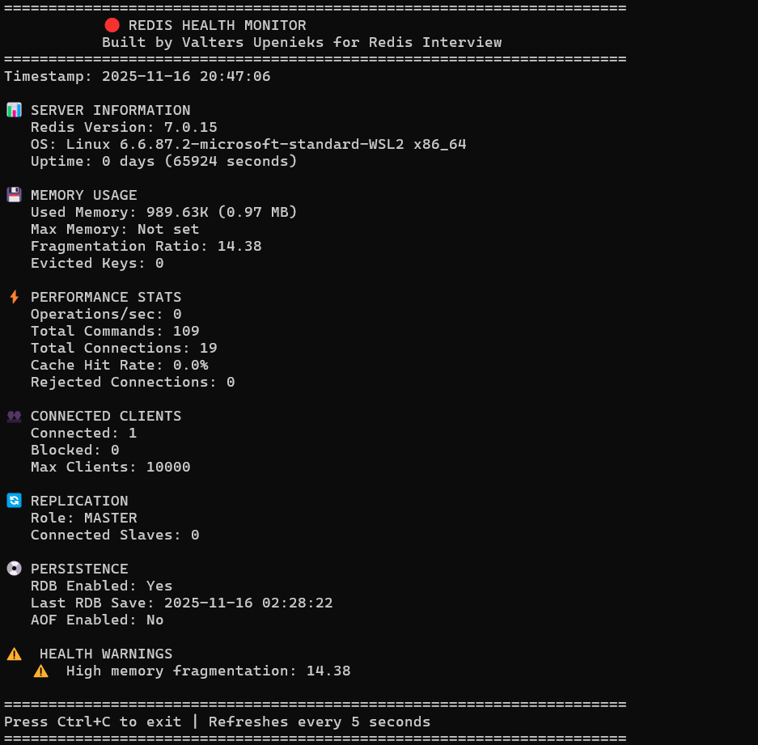

# Redis Health Monitor

A diagnostic tool for Redis support engineers to quickly assess Redis instance health.

**Author:** Valters Upenieks  
**Created for:** Redis Technical Support Engineer Interview

## Features

✅ Real-time health monitoring  
✅ Memory usage tracking  
✅ Performance metrics (ops/sec, hit rate)  
✅ Client connection monitoring  
✅ Replication status  
✅ Slow query detection  
✅ Automated health warnings  
✅ Bash quick-check script  

## Installation
```bash
# Install dependencies
pip install -r requirements.txt

# Or install redis directly
pip install redis
```

## Usage

### Python Monitor (Continuous)
```bash
# Monitor local Redis
python3 monitor.py

# Monitor remote Redis
python3 monitor.py --host redis-server.com --port 6379

# Run once (no continuous refresh)
python3 monitor.py --once

# Custom refresh interval
python3 monitor.py --interval 10
```

### Bash Quick Check
```bash
# Quick diagnostic
./check_redis.sh
```

## What It Monitors

### Server Information
- Redis version
- OS
- Uptime

### Memory
- Used memory
- Memory limit
- Fragmentation ratio
- Evicted keys

### Performance
- Operations per second
- Total commands processed
- Cache hit rate
- Rejected connections

### Clients
- Connected clients
- Blocked clients
- Max clients limit

### Replication
- Role (master/slave)
- Connected slaves (if master)
- Replication link status (if slave)

### Persistence
- RDB status
- AOF status
- Last save time

### Slow Queries
- Recent slow commands (>10ms)

## Health Checks

Automatically warns about:
- ⚠️ High memory fragmentation (>1.5)
- ⚠️ Keys being evicted
- ⚠️ High client usage (>80%)
- ⚠️ Low cache hit rate (<80%)
- ❌ Broken replication

## Screenshots



## Skills Demonstrated

- **Python:** Object-oriented programming, error handling, CLI arguments
- **Redis:** INFO commands, SLOWLOG, health monitoring
- **Linux:** Bash scripting, process monitoring, system diagnostics
- **Support Mindset:** Proactive monitoring, clear warnings, actionable insights

## Why This Tool?

As a Technical Support Engineer at Redis, quick diagnostics are essential. This tool:
1. Provides instant visibility into Redis health
2. Identifies common issues automatically
3. Helps prioritize troubleshooting efforts
4. Can be shared with customers for self-diagnosis

## Real-World Application

At Yggdrasil Gaming, I resolved 100+ integration issues monthly. Tools like this would have:
- Reduced mean time to resolution
- Enabled proactive monitoring
- Improved customer self-service
- Standardized diagnostic approach

## Future Enhancements

- [ ] Web dashboard (Flask/FastAPI)
- [ ] Historical metrics (store in Redis TimeSeries!)
- [ ] Alert notifications (email/Slack)
- [ ] Multi-instance monitoring
- [ ] Export reports (PDF/CSV)
- [ ] Integration with Prometheus

## License

MIT - Feel free to use and modify!

## Contact

**Valters Upenieks**  
📧 valtersupenieks@gmail.com  
💼 [LinkedIn](https://linkedin.com/in/valters-upenieks)  
🐙 [GitHub](https://github.com/Golden-Sins)
